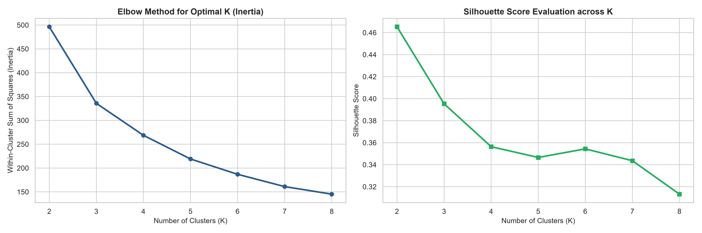
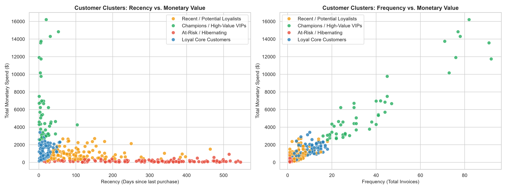
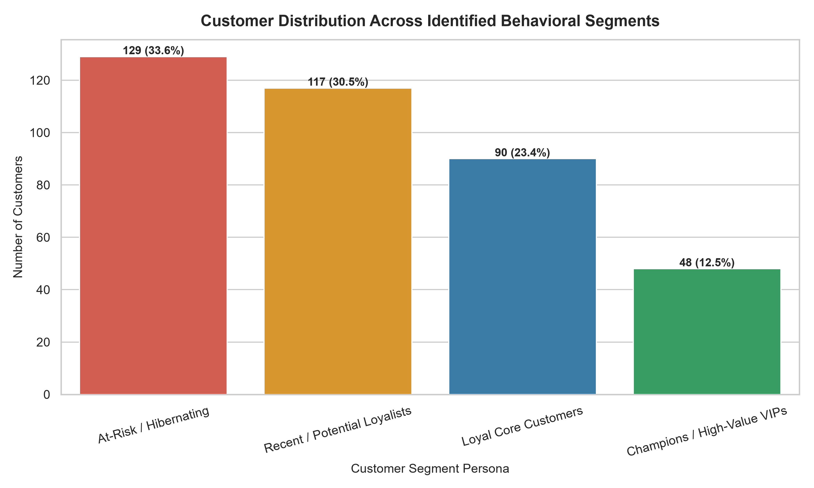

# 🛍 Customer Segmentation Analysis using RFM & K-Means Clustering

**Organization:** Oasis Infobyte (OIBSIP)  
**Track:** Data Analytics (Level 1 • Task 2)  
**Author:** Narendra

---

## 📌 Project Overview
This project implements an unsupervised Machine Learning pipeline to segment e-commerce customers based on the **RFM (Recency, Frequency, Monetary)** behavioral framework. Using the Elbow Method and Silhouette Analysis, the model identifies 4 actionable commercial personas and provides tailored retention strategies.

---

## 📁 Repository Structure
```text
├── charts/
│   ├── elbow_and_silhouette_analysis.png
│   ├── customer_segments_2d_scatter.png
│   └── segment_distribution_barchart.png
├── data/
│   └── ecommerce_transactions.csv
├── notebooks/
│   └── customer_segmentation.ipynb
├── report/
│   └── findings_and_recommendations.md
├── ml_core.py
├── run_segmentation.py
├── requirements.txt
└── README.md
```

---

## 📈 Visualizations & Key Charts

### 1. Optimal Cluster Evaluation (Elbow & Silhouette)


### 2. 2D Cluster Scatter Projections


### 3. Customer Segment Distribution


---

## 📄 Detailed Findings & Playbook
For the complete customer persona breakdown and retention marketing strategy, see **[report/findings_and_recommendations.md](report/findings_and_recommendations.md)**.

---

## 🚀 How to Run Locally
```bash
pip install -r requirements.txt
python run_segmentation.py
jupyter notebook notebooks/customer_segmentation.ipynb
```
